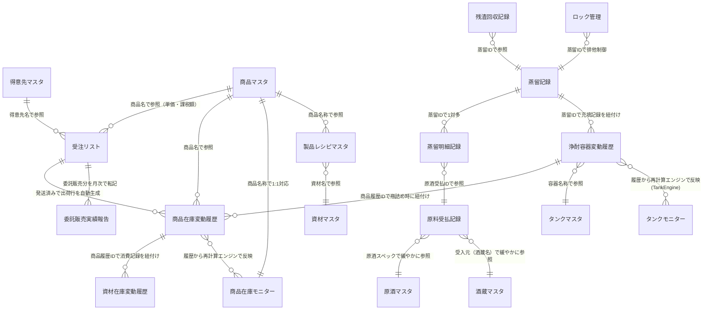

# NOTO Naorai株式会社 受注・製造管理システム データ構造ドキュメント

作成日：2026年8月21日

---

## 1. このドキュメントの目的

これまでの開発で作成してきた機能一覧と、それによって生まれるデータ、
そして各シート同士のつながり（リレーション）を、あらためて整理したものです。

理想的なデータ構造を示すだけでなく、**現状特有の癖・注意点**、
そして**具体的な改善案**も最後にまとめています。

---

## 2. 全シート一覧（カテゴリ別）

| カテゴリ | シート名 |
|---|---|
| 受注・売上系 | 受注リスト／商品在庫変動履歴／商品在庫モニター／委託販売実績報告／サンプル、販促資料送付／売上目標 |
| 蒸留・原酒系 | 蒸留記録／蒸留明細記録／原料受払記録／残渣回収記録／原酒マスタ／酒蔵マスタ |
| タンク系 | 浄酎容器変動履歴／タンクマスタ／タンクモニター／ロック管理 |
| 資材系 | 資材在庫変動履歴／資材マスタ |
| マスタ系 | 商品マスタ／製品レシピマスタ／得意先マスタ |

全21シートです。

---

## 3. 全体ER図（データのつながり）

以下はMermaid記法によるER図です。GitHubやNotion、対応するMarkdownビューアで
開くと、図として表示されます（線と矢印で関係を表しています）。

**読み方の補足**：`||--o{`は「1対多」、`}o--o{`は「多対多、または名前ベースの緩やかな対応」を表しています。
IDで厳密に紐付いているものと、名前（文字列）だけで緩やかに対応しているものが混在している点が、
このシステムの特徴かつ注意点です（詳細は6章）。

---

## 4. シート別・全列の詳細説明

### 4-1. 受注リスト

受注1件（1商品）を1行として記録する、システムの中核となるシートです。
1つの受注で複数商品を頼まれた場合は、同じ受注番号で複数行に分かれます。

| 列 | 列名 | 説明 |
|---|---|---|
| A | 受注番号 | `D`+年月(4桁)+連番(4桁)。例：D2608-0001。月ごとに1からリセット |
| B | 受注日 | 受注を受けた日（時刻なし） |
| C | 得意先名 | 得意先マスタの「得意先名」と一致させる文字列 |
| D | 商品名 | 商品マスタの「商品名称」と一致させる文字列 |
| E | 本数 | 注文本数 |
| F | 単価 | 商品マスタの「上代」から自動取得 |
| G | 掛け率 | 得意先マスタの「掛率」から自動取得（得意先ごとの卸率） |
| H | 売価 | 単価×本数×掛け率（自動計算） |
| I | 送料 | 送料計算機能で算出、またはマニュアル入力 |
| J | 合計(税込) | 売価＋送料 |
| K | 納入希望日 | 得意先が希望する納品日（任意入力） |
| L | 請求日 | 請求書を送付した日。手動チェック、または一括処理で記録 |
| M | 入金予定日 | 納品日＋得意先の支払いサイトから自動計算 |
| N | 入金日 | 実際に入金があった日（手動記録） |
| O | 販売方法 | 「買取」「委託」等 |
| P | 納品方法 | 「配送」「手渡し」等 |
| Q | ステータス | 「未着手」「発送済」等。「発送済にする」ボタンでQ=発送済に変更される |
| R | 配送先 | 配送先住所（任意メモ含む） |
| S | 納品日（発送日、配達日） | 「発送済にする」ボタン押下時に入力した日付。時刻なし |
| T | 備考 | 自由記述 |
| U | ID | 内部管理用のランダムID（8桁英数字） |

**書き込み元**：`submitOrder()`（新規登録）、`markOrderAsShipped()`（Q・S・M列を更新）、
`markInvoiceSent()`/`markInvoicesSent()`（L列を更新）

**読み取り先**：ダッシュボード集計、CSV出力（ゆうパック・マネーフォワード）、
在庫監査レポート（S列×D列で商品在庫変動履歴と突合）

---

### 4-2. 商品在庫変動履歴

商品・仕掛品の在庫が動くたびに1行追加される、**取引履歴（台帳）**です。
商品在庫モニターの現在値は、このシートの全履歴から再計算されます。

| 列 | 列名 | 説明 |
|---|---|---|
| A | 日付 | 取引が発生した日（時刻なし） |
| B | 商品 | 商品マスタの「商品名称」と一致させる文字列（※このシートだけ列名が「商品」で、他シートの「商品名称」と表記が異なる点に注意） |
| C | 受払 | 「瓶詰」「箱詰」「出荷」「返品」「棚卸調整（商品）」「棚卸調整（仕掛品）」「欠損（商品）」「欠損（仕掛品）」のいずれか |
| D | 数量 | 常に正の数。受払の種類によって増減方向が決まる |
| E | 受入元/払出先 | 出荷なら得意先名、瓶詰めならタンクID等、文脈依存の自由記述 |
| F | 商品履歴ID | `L`+年月(4桁)+連番。資材在庫変動履歴・浄酎容器変動履歴と紐付けるための共通キー |
| G | 備考 | 自由記述。取消処理をした場合は先頭に「取消済み」と付き、集計対象から除外される |
| H | 保管場所 | 「浄溜所」等の固定文字列を記録（表示用） |
| I | 容量(ml) | 商品マスタの「容量(ml)」×本数（出荷時のみ記録） |
| J | 課税額 | 商品マスタの「課税額」×本数（出荷時のみ記録） |
| K | データ区分 | 「運用中（リアルタイム）」「過去（遡り入力）」等の運用メタ情報 |
| L | 受注番号 | ※今回新設した列。受注リストとの突合精度向上のため、出荷記録に受注番号を記録するようにした。過去データには入っていない |

**書き込み元**：`submitBottlingV2()`（瓶詰）、`submitBoxing()`（箱詰）、
`markOrderAsShipped()`（出荷）、`submitSampleShipment()`（出荷／サンプル）、
`submitProductReturn()`（返品）、`submitProductStocktaking()`（棚卸調整・欠損）

**読み取り先**：`computeAllProductStockStates()`（商品在庫モニターへの再計算元）、
在庫監査レポート（①重複検出・③受注リスト突合・④資材消費監査）

---

### 4-3. 商品在庫モニター

現時点の在庫数を商品ごとに1行で表示する、**現在値のスナップショット**シートです。
商品在庫変動履歴の全履歴から計算し直された結果が、ここに書き戻されます。

| 列 | 列名 | 説明 |
|---|---|---|
| A | 商品名称 | 商品マスタと一致させる文字列（※このシートは「商品名称」、商品在庫変動履歴は「商品」と表記が異なる） |
| B | 商品 | 完成品の在庫数（本） |
| C | 仕掛品 | 瓶詰め済み・箱詰め前の在庫数（本） |
| D〜K | 容器／キャップ／裏ラベル／紙垂／フィルム／箱ラベル／化粧・桐箱／段ボール外箱(1ケース分) | 各資材の在庫数（本シート内で直接管理。資材在庫変動履歴とは連動していない） |

**書き込み元**：`syncProductStockFromLedger()`（商品在庫変動履歴から再計算）

**読み取り先**：ダッシュボード（在庫状況・アラート）、受注登録画面（在庫僅少アラート）

**⚠️注意点**：D〜K列（資材の在庫数）は商品在庫変動履歴や資材在庫変動履歴と自動連動していません。
この点は6章・7章で詳しく扱います。

---

### 4-4. 委託販売実績報告

委託販売の得意先について、月次で実績を転記するためのシートです。
受注リストとほぼ同じ列構成ですが、独立したシートとして運用されています。

| 列 | 列名 | 説明 |
|---|---|---|
| A | 受注番号 | 受注リストの受注番号をそのまま転記 |
| B | 対象月 | 報告対象となる年月 |
| C | 得意先名 | 委託先の得意先名 |
| D | 商品名 | 商品名 |
| E | 本数 | 実売本数 |
| F | 単価 | 単価 |
| G | 掛け率 | 掛け率 |
| H | 売価 | 売価 |
| I | 送料 | 送料 |
| J | 請求日 | 転記時に自動記録 |
| K | 入金予定日 | 転記月の月末が自動設定される |
| L | 入金日 | 入金があった日（手動） |
| M | 備考 | 自由記述 |
| N | ID | 内部管理用ランダムID |

**書き込み元**：`submitConsignmentReport()`

**読み取り先**：`getConsignmentCustomers()`（画面の得意先プルダウン用）

---

### 4-5. サンプル、販促資料送付

無償のサンプル・販促資料送付を記録するシートです。

| 列 | 列名 | 説明 |
|---|---|---|
| A | 発送日 | 送付日（時刻なし） |
| B | 得意先名 | 送付先の得意先名 |
| C | 得意先名前 | 先方の担当者名（列名は「得意先名前」だが実質は担当者名を記録） |
| D | 商品名 | 送付した商品名 |
| E | 本数 | 送付本数 |
| F | 後追い連絡日 | フォローアップ予定日（現状未入力のまま運用） |
| G | 電話番号 | 先方の電話番号 |
| H | データ区分 | 「運用中（リアルタイム）」等 |
| I | 備考 | 自由記述 |
| J | ID | 内部管理用ランダムID |

**書き込み元**：`submitSampleShipment()`（このシートへの記録と同時に、商品在庫変動履歴にも
「出荷」として記録し、商品在庫モニターから減算する）

---

### 4-6. 売上目標

月ごとの売上目標値を保持する、非常にシンプルなシートです。

| 列 | 列名 | 説明 |
|---|---|---|
| A | 対象月 | 目標を設定する年月 |
| B | 目標売上高 | 金額（円） |
| C | 備考 | 自由記述 |

**書き込み元**：`setSalesTarget()`

**読み取り先**：ダッシュボードの「当月進捗率」表示

---

### 4-7. 蒸留記録

1回の蒸留作業を1行として記録するシートです。

| 列 | 列名 | 説明 |
|---|---|---|
| A | 蒸留日 | 投入開始日時。**意図的に時刻を残している**（24時間経過アラートの計算に使うため） |
| B | 使用原酒明細 | 投入した原酒ロットの概要（自由記述／自動生成） |
| C | 投入量合計 | 投入した原酒の合計量(L) |
| D | 蒸留設定時間 | 予定所要時間 |
| E | ステータス | 「蒸留中」「完了」等 |
| F | 蒸留量 | 完了時に記録される、実際に得られた浄酎量(L) |
| G | アルコール度数 | 完了時の実測度数 |
| H | 払出先 | 蒸留完了後、浄酎を払い出したタンク名 |
| I | 残渣回収量 | 残渣として回収した量 |
| J | 蒸留ID | `D`+年月+連番。他シートとの主キー |
| K | ID | 内部管理用ランダムID |

**書き込み元**：`submitDistillationStart()`（開始時）、蒸留完了報告処理（完了時にE〜I列を更新）

**読み取り先**：`getStaleDistillationAlerts()`（24時間超過アラート）、蒸留明細記録・残渣回収記録・
浄酎容器変動履歴・ロック管理から蒸留IDで参照される

---

### 4-8. 蒸留明細記録

1回の蒸留に対して、複数の原酒ロットを投入した場合の内訳を記録します（1蒸留・複数行）。

| 列 | 列名 | 説明 |
|---|---|---|
| A | 明細ID | この明細行を一意に識別するID |
| B | 蒸留ID | 蒸留記録の蒸留IDを参照 |
| C | 原酒受払ID | 原料受払記録の原酒受払IDを参照（どのロットを使ったか） |
| D | 投入数量(L) | このロットからの投入量 |
| E | 元容器ID | 投入元のタンクID |
| F | 備考 | 部分取消の際は「取消済み」が先頭に付く |
| G | ID | 内部管理用ランダムID |

**書き込み元**：`submitDistillationStart()`、`addDistillationDetailItem()`（部分取消後の再投入）

**読み取り先**：`cancelDistillationDetailItem()`（部分取消処理）

---

### 4-9. 原料受払記録

原酒タンクへの「受入」（原酒入荷・蒸留完了による充填）と「払出」（蒸留への投入）を記録する台帳です。

| 列 | 列名 | 説明 |
|---|---|---|
| A | 日付 | 取引日 |
| B | 受払 | 「受入」または「払出」 |
| C | 受入元 | 払出の場合：投入元タンクID |
| D | 受払量 | 常に正の数 |
| E | 払出先 | 受入の場合：受入先タンクID、払出の場合：蒸留ID |
| F | 原酒受払ID | 払出は0001から、受入は1000刻みでロット・月ごとに採番 |
| G | ID | 内部管理用ランダムID |
| H | 原酒スペック | 銘柄・度数等の自由記述（原酒マスタの内容と重複しうる） |
| （末尾） | FIFO推定 | 過去データ一括変換時のみ、動的に追加される列（通常運用では存在しない） |

**書き込み元**：`submitRawSakeReceipt()`（受入）、`submitDistillationStart()`（払出）、
`cancelDistillationDetailItem()`（取消時の受入戻し）

**読み取り先**：`estimateRawSakeFifoLinks_()`（過去データ移行時のFIFO推定、通常運用では未使用）

---

### 4-10. 残渣回収記録

蒸留後の残渣（廃液）の回収記録です。

| 列 | 列名 | 説明 |
|---|---|---|
| A | 残渣回収日 | 回収日時（時刻あり。蒸留記録と同様の理由） |
| B | 回収量 | 回収量 |
| C | アルコール度数 | 残渣の残留アルコール度数 |
| D | 食塩ステータス | 塩分添加等の状態 |
| E | 投入量 | 食塩等の投入量 |
| F | 塩分濃度 | 濃度(%) |
| G | 払出先 | 廃棄先・保管先 |
| H | 蒸留ID | どの蒸留由来の残渣かを参照 |

**書き込み元**：蒸留完了報告処理の一部として記録

---

### 4-11. 原酒マスタ

原酒の銘柄マスタです。

| 列 | 列名 | 説明 |
|---|---|---|
| A | 銘柄 | 原酒の名称 |
| B | アルコール度数 | 規定度数 |
| C | 日本酒度 | 日本酒度の値 |
| D | 酒蔵 | 仕入元の酒蔵名（酒蔵マスタと緩やかに対応） |
| E | ステータス | 「取引中」等 |
| F | 製造年(月) | 製造時期 |
| G | 備考 | 自由記述 |
| H | ID | 内部管理用ランダムID |
| I | 移入日 | マスタ登録日（時刻なし） |
| J | 初期在庫量 | 登録時点での在庫量（現状は参照用途が限定的） |
| K | 現在在庫量 | 同上（自動更新の仕組みはなく、現状は原料受払記録側で実質管理） |

**書き込み元**：`registerRawSake()`

**読み取り先**：`getRawSakeBrands()`（原酒入荷画面のプルダウン）

---

### 4-12. 酒蔵マスタ

仕入先の酒蔵情報を管理する、シンプルなマスタです。

| 列 | 列名 | 説明 |
|---|---|---|
| A | 酒蔵ID | 内部ID |
| B | 酒蔵名 | 酒蔵の名称 |
| C | 住所 | 所在地 |
| D | 電話番号 | 連絡先 |
| E | 担当者名 | 窓口担当者 |
| F | 取引開始日 | 取引開始日 |

**⚠️注意点**：現状、コードから自動参照される仕組みがなく、原酒入荷画面では
`payload.supplier`として**自由入力の文字列**を受け付けています。酒蔵マスタとの
突合は行われていません（7章で改善案として扱います）。

---

### 4-13. 浄酎容器変動履歴

タンク間の原酒・浄酎の動きを記録する台帳です。タンク残量計算エンジン（TankEngine.gs）が、
このシートの全履歴からタンクマスタの現在値を再計算します。

| 列 | 列名 | 説明 |
|---|---|---|
| A | 日付 | 取引日（時刻なし） |
| B | 受入元 | 払出元となるタンク名（容器移動・瓶詰め・未納税移出等で使用） |
| C | 受払 | 「継足」「瓶詰」「容器移動」「未納税移出」「欠減」「棚卸調整」「取消戻し」等 |
| D | 瓶詰め商品 | 瓶詰め時のみ、対象商品名を記録 |
| E | 払出先 | 払出先となるタンク名、または「直接充填」等 |
| F | 数量(L) | 常に正の数 |
| G | アルコール度数 | 加重平均で自動計算される度数（%表記の文字列） |
| H | 商品履歴ID | 瓶詰め時、商品在庫変動履歴の商品履歴IDと紐付け |
| I | 蒸留ID | 継足（蒸留完了による充填）時、蒸留記録の蒸留IDと紐付け |
| J | データ区分 | 運用メタ情報 |
| K | 備考 | 取消時は「取消済み」が先頭に付く。棚卸調整の理由もここに記録 |

**書き込み元**：`submitDistillationStart()`／蒸留完了処理（継足）、`submitBottlingV2()`（瓶詰め）、
`submitTankTransfer()`（容器移動）、`submitTaxFreeTransfer()`（未納税移出）、
`submitStocktaking()`（棚卸調整・欠減）

**読み取り先**：`computeAllTankStates()`（タンクマスタへの再計算元）

---

### 4-14. タンクマスタ

全タンク・容器の現在の状態を1行ずつ管理するシートです。

| 列 | 列名 | 説明 |
|---|---|---|
| A | 容器ID | プレフィックス＋連番。T=ステンレスタンク、B=木樽、SP=原酒ポリタンク、U=残渣タンク、G=一斗瓶、JP=出荷用ポリタンク、Q=QBテナー、DISTL=蒸留機 |
| B | 容器名称 | 表示名。浄酎容器変動履歴の受入元/払出先と、この名称で紐付く |
| C | 容器種別 | 上記プレフィックスに対応する種別名 |
| D | 最大容量(L) | 容量の上限 |
| E | 現在設置場所 | 「浄溜所」「熟成室」等 |
| F | ステータス | 「稼働中」「空」「満タン」「廃棄」 |
| G | 検尺定数 | 検尺棒での実測換算に使う定数（任意） |
| H | 初期在庫量 | 登録時点の値（参照用途は限定的） |
| I | 現在液量(L) | タンク残量計算エンジンにより自動更新される |
| J | 理論アルコール度数 | 同上、加重平均で自動更新 |
| K | 備考 | 自由記述 |

**書き込み元**：`registerTank()`（新規登録）、`syncTankMasterFromLedger()`（I・J・F列を再計算・更新）

**読み取り先**：容器移動・未納税移出・棚卸調整・瓶詰め等、ほぼ全画面のタンク選択プルダウン

---

### 4-15. タンクモニター

タンクの状態を一覧表示するための、**表示専用**シートです。

| 列 | 列名 | 説明 |
|---|---|---|
| A | 浄酎タンク | タンク名 |
| B | アルコール度数 | 度数 |
| C | 現在液量 | 現在の残量 |
| D | 最大液量 | 最大容量 |
| E | 貯蔵率 | 現在液量÷最大液量 |
| F | 300ml充填本数 | 300ml換算の本数目安 |
| G | 700ml充填本数 | 700ml換算の本数目安 |

**⚠️注意点**：このシートは現状、**コードから直接読み書きされていません**。
手動更新か、スプレッドシートの数式で参照している可能性があります（要確認、7章参照）。

---

### 4-16. ロック管理

同時編集による競合を防ぐための排他制御シートです。

| 列 | 列名 | 説明 |
|---|---|---|
| A | 対象ID | ロック対象（通常は蒸留ID） |
| B | ユーザー | ロックを取得したユーザー |
| C | ロック時刻 | 取得時刻（24時間経過で自動解除） |
| D | 蒸留ID | 対象の蒸留ID |

**書き込み元**：`lockTank_()` / 解除処理

---

### 4-17. 資材在庫変動履歴

資材（瓶・キャップ・ラベル・箱等）の入荷・消費を記録する台帳です。

| 列 | 列名 | 説明 |
|---|---|---|
| A | 日付 | 取引日（時刻なし） |
| B | 資材名称 | 資材マスタの「資材名」と一致させる文字列 |
| C | 受払 | 「入荷」「消費」等 |
| D | 数量 | 常に正の数 |
| E | 受入元/払出先 | 入荷元の仕入先名等 |
| F | 備考 | 自由記述。取消時は「取消済み」が先頭に付く |
| G | 資材履歴ID | `M`+年月+連番 |
| H | 商品履歴ID | **消費記録の場合、どの瓶詰め／箱詰め作業で消費されたかを示す紐付けキー**（商品在庫変動履歴と対応） |
| I | 元ID | 内部管理用ランダムID |
| J | 単価 | 入荷時の単価 |
| K | 合計金額 | 数量×単価 |
| L | データ区分 | 運用メタ情報 |

**書き込み元**：`submitMaterialReceipt()`（入荷）、`submitBottlingV2()`／`submitBoxing()`（消費、
製品レシピマスタのレシピに基づき自動計算）

**読み取り先**：`auditMaterialConsumption_()`（商品履歴IDで商品在庫変動履歴と突合し、
レシピ通りに消費されているか監査）

**⚠️注意点**：このシートには**現在の在庫数を集計するモニターシートが存在しません**。
商品・タンクと違い、資材の「今の在庫数」はどこにも数値化されていません（7章参照）。

---

### 4-18. 資材マスタ

資材そのものの情報を管理するマスタです。

| 列 | 列名 | 説明 |
|---|---|---|
| A | 資材ID | 内部ID |
| B | 資材名 | 資材の名称（他シートの「資材名称」表記と微妙に異なる点に注意） |
| C | 資材種別 | カテゴリ |
| D | 単位 | 「本」「枚」等 |
| E | 単価(円) | 基準単価 |
| F | ロット数 | この数の倍数でのみ入荷登録できる |
| G | 適正在庫数 | 目標在庫水準（現状アラート等では未活用） |
| H | 初期在庫数 | 運用開始時点の在庫数 |
| I | 発注先会社名 | 仕入先 |
| J | 発注先住所 | 仕入先住所 |
| K | 発注先担当者名 | 仕入先の窓口 |
| L | 備考 | 自由記述 |
| M | リードタイム | 発注から納品までの日数目安 |
| N | 単価×ロット数(円) | 1ロットあたりの金額（表示用の計算列） |

**書き込み元**：手動登録（マスター画面）

**読み取り先**：`getMaterialDefaultPrice()`（資材入荷画面での単価・ロット数自動表示）

**⚠️注意点**：B列は「資材名」、資材在庫変動履歴では「資材名称」、製品レシピマスタでも「資材名」と、
表記が完全に統一されていません（幸い、コード側は各シートの実際の表記に正しく合わせているため
機能上の不具合はありませんが、人が見比べる際は紛らわしい点です）。

---

### 4-19. 商品マスタ

商品そのものの情報を管理する、最も重要なマスタの1つです。

| 列 | 列名 | 説明 |
|---|---|---|
| A | 商品名称 | 商品名。他の全シートがこの文字列で商品を参照する（表記ゆれ厳禁） |
| B | 容量(ml) | 1本あたりの内容量 |
| C | 規定度数 | アルコール度数 |
| D | 容器タイプ | 瓶／パウチ等 |
| E | 単位 | 「本」等 |
| F | 上代 | 販売単価 |
| G | JAN | JANコード |
| H | 目標エキス分基準 | 品質管理上の基準値 |
| I | 備考 | 自由記述 |
| J | 商品カテゴリ | 分類 |
| K | 商品ID | 内部ID |
| L | 初期商品在庫数 | 商品在庫モニターの再計算エンジンが、ここを出発点として履歴を積み上げる |
| M | 初期仕掛品在庫数 | 同上（仕掛品側） |
| N | 課税額 | 1本あたりの酒税額。受注出荷・サンプル送付時の課税額計算に使用 |

**書き込み元**：`registerProductWithRecipe()`（新規登録時、同時に製品レシピマスタへもレシピを登録）

**読み取り先**：ほぼ全ての受注・瓶詰め・在庫関連機能から参照される、中心的なマスタ

---

### 4-20. 製品レシピマスタ

1商品を作るのに必要な資材の組み合わせ（レシピ）です。1商品につき複数行（資材の数だけ）あります。

| 列 | 列名 | 説明 |
|---|---|---|
| A | レシピID | 内部ID |
| B | 商品名称 | 商品マスタの商品名称と対応 |
| C | 資材名 | 資材マスタの資材名と対応 |
| D | 必要数量 | 1本あたりの必要数 |
| E | ステータス | 「瓶詰」工程用か「箱詰」工程用か等の区分 |

**書き込み元**：`registerProductWithRecipe()`

**読み取り先**：`getRecipeForProduct_()`（瓶詰め・箱詰め時の資材消費量の自動計算）、
`auditMaterialConsumption_()`（資材消費監査の理論値算出）

---

### 4-21. 得意先マスタ

得意先の情報を管理するマスタです。

| 列 | 列名 | 説明 |
|---|---|---|
| A | 顧客ID | 内部ID |
| B | 得意先名 | 受注リスト等が参照する文字列 |
| C | 区分 | 分類 |
| D | 業態 | 小売／飲食店等 |
| E | 掛率 | 卸率。受注登録時の売価計算に使用（**列名は「掛率」であり「掛け率」ではない**点に注意） |
| F | 住所 | 所在地 |
| G | 支払いサイト月数 | 「翌月」「翌々月」等 |
| H | 支払いサイト日付 | 「末日」等 |
| I | 請求日送付期日 | 請求書送付の目安日 |
| J | 備考 | 自由記述 |
| K | 担当者 | 営業管理タブで追加運用 |
| L | サブ担当者 | 同上 |
| M | 流通経路 | 同上 |
| N | 最終訪問日 | 同上 |
| O | 取引開始月 | 同上 |

**書き込み元**：`registerCustomer()`（基本情報）、`updateCustomerSalesInfo()`（K〜O列の営業管理情報）

**読み取り先**：`getCustomerOptions()`（受注登録画面のプルダウン、掛率・支払いサイトの自動反映）

---

## 5. データ連携の全体像（機能一覧とその成果物）

これまで作成した主な機能と、それぞれが「どのデータを生み、どこへ影響するか」を一覧にします。

| 機能 | 主な入力 | 生成・更新されるデータ |
|---|---|---|
| 受注登録 | 得意先・商品・本数 | 受注リストに1〜複数行追加 |
| 発送済にする | 受注番号・納品日 | 受注リストのステータス更新、商品在庫変動履歴に出荷行追加、入金予定日を自動計算 |
| 瓶詰め登録 | タンク・商品・本数 | 商品在庫変動履歴（瓶詰行）、資材在庫変動履歴（資材消費）、浄酎容器変動履歴（タンク減算） |
| 箱詰め登録 | 仕掛品ロット・商品・本数 | 商品在庫変動履歴（箱詰行）、資材在庫変動履歴（資材消費） |
| 商品在庫の再計算 | （履歴の全件） | 商品在庫モニターのB・C列を上書き |
| タンク残量の再計算 | （履歴の全件） | タンクマスタのI・J・F列を上書き |
| 棚卸調整（タンク／商品） | 実測値・理由 | 各履歴シートへ調整行を追加し、再計算エンジンを呼び出す |
| 蒸留の開始・完了 | 原酒タンク・投入量 | 蒸留記録・蒸留明細記録・原料受払記録・浄酎容器変動履歴に記録 |
| 在庫監査レポート | （履歴の全件） | 「在庫監査レポート」シートを新規作成し、差分一覧を出力（一度きりの調査用） |
| CSV出力 | 受注リストの選択行 | ゆうパック用・マネーフォワード用CSVファイルを生成 |

---

## 6. 現状の癖・注意点

### 6-1. 「同じ意味の列」でも、シートごとに表記が異なる

| 意味 | 表記が異なる例 |
|---|---|
| 商品名 | 商品マスタ・商品在庫モニター・製品レシピマスタ・受注リストでは「商品名称」または「商品名」だが、**商品在庫変動履歴だけ「商品」** |
| 資材名 | 資材マスタでは「資材名」だが、**資材在庫変動履歴では「資材名称」** |
| 得意先の掛け率 | 一般的には「掛け率」と読み書きするが、**得意先マスタの実際の列名は「掛率」**（けなし） |

これらは全て、コード側で実際の表記に合わせて個別に対応済みです。ただし、
**今後シートを人の手で編集する際、名称を統一していると誤解しないよう**ご注意ください。

### 6-2. IDによる厳密な紐付けと、名前による緩やかな紐付けが混在している

- **IDで厳密に紐付いているもの**：商品履歴ID（商品在庫変動履歴⇔資材在庫変動履歴⇔浄酎容器変動履歴）、
  蒸留ID（蒸留記録⇔蒸留明細記録⇔残渣回収記録⇔ロック管理）、原酒受払ID（蒸留明細記録⇔原料受払記録）
- **名前（文字列）だけで緩やかに紐付いているもの**：得意先名（受注リスト⇔得意先マスタ）、
  商品名（各シート⇔商品マスタ）、タンク名（浄酎容器変動履歴⇔タンクマスタ）、
  酒蔵名（原料受払記録⇔酒蔵マスタ、しかも自由入力のため実質的に紐付いていない）

名前ベースの紐付けは、**表記ゆれ（全角半角・スペースの有無等）が起きると突合できなくなる**
リスクを常に抱えています。

### 6-3. 受注番号列（商品在庫変動履歴L列）は移行期の状態

過去データにはこの列自体が存在しません。今のところ、在庫監査レポートでは
受注番号ではなく「日付×商品名」の集計比較を採用しているため実害はありませんが、
将来的に受注番号ベースの厳密な突合を行いたい場合は、過去データへの遡及入力が必要です。

### 6-4. 資材の「現在在庫数」を集計する仕組みが存在しない

商品（商品在庫モニター）・タンク（タンクマスタ）には「現在値を計算し直すエンジン」がありますが、
**資材だけは、資材在庫変動履歴という台帳があるのみで、現在庫数を一覧できるシートがありません**。
資材が今どれだけ残っているかを知りたい場合、現状は手動で履歴を追うしかありません。

### 6-5. タンクモニターシートが浮いている

「4-15」で触れた通り、タンクモニターシートはコードから読み書きされておらず、
実際に運用で使われているか・数式で自動更新されているか、確認できていません。

### 6-6. 酒蔵マスタが実質未使用

酒蔵マスタは存在しますが、原酒入荷登録の際「受入元（酒蔵名）」は自由入力欄になっており、
マスタとの照合や選択式のプルダウンにはなっていません。

---

## 7. 改善提案

これまでの癖を踏まえ、以下の改善を提案します。優先度の高いものから並べています。

### 7-1.【提案】資材在庫モニターの新設（優先度：高）

タンク・商品と同様に、**資材在庫変動履歴の全履歴から現在庫数を再計算するエンジン**と、
その結果を表示する「資材在庫モニター」シートを新設することを提案します。
これにより、瓶やキャップ、ラベル等の在庫切れに事前に気づけるようになります
（`ProductStockEngine.gs` / `TankEngine.gs`と同じ設計パターンを踏襲できます）。

### 7-2.【提案】列名の表記統一（優先度：中）

「商品」と「商品名称」、「資材名」と「資材名称」、「掛率」と「掛け率」など、
意味は同じでも表記が異なる列名を、**どこかのタイミングで統一する**ことを提案します。
ただし、これは影響範囲が広い（全appendRow・全indexOfの見直しが必要）ため、
急ぎでなければ次回のシステム改修時期にまとめて行うのが安全です。

### 7-3.【提案】タンクモニターシートの役割整理（優先度：中）

このシートを「今後も使う（自動更新の仕組みを追加する）」か、
「もう使わない（削除する、またはタンクマスタへ一本化する）」か、
方針を決めることを提案します。使われているかどうか不明なまま放置すると、
誤って古い情報を参照してしまうリスクがあります。

### 7-4.【提案】酒蔵マスタとの連携（優先度：低〜中）

原酒入荷画面の「受入元」を自由入力から、酒蔵マスタを参照したプルダウン選択に変更することを提案します。
これにより、表記ゆれによる集計ミスを防げます（得意先マスタ・商品マスタと同じ扱いにする形です）。

### 7-5.【提案】商品在庫変動履歴への受注番号の遡及入力（優先度：低）

過去データに受注番号を手動またはスクリプトで補完できれば、将来的に日付×商品名の
集計比較だけでなく、受注番号ベースでの1対1の厳密な突合も可能になります。
ただし、日付×商品名ベースの監査で現状大きな問題は出ていないため、緊急性は高くありません。

---

以上です。ご不明な点や、特定のシート・機能についてさらに深掘りしたい箇所があれば、
遠慮なくお申し付けください。
